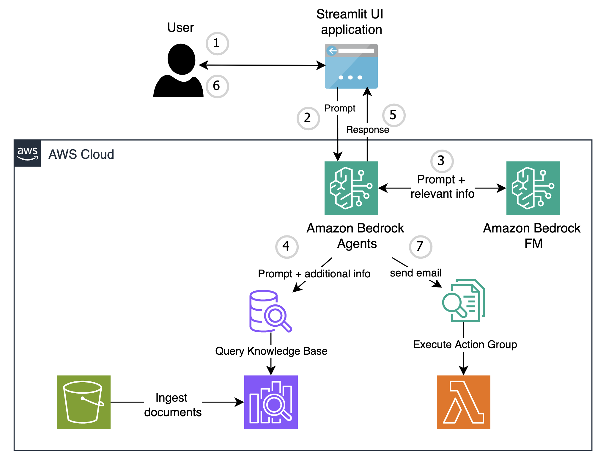
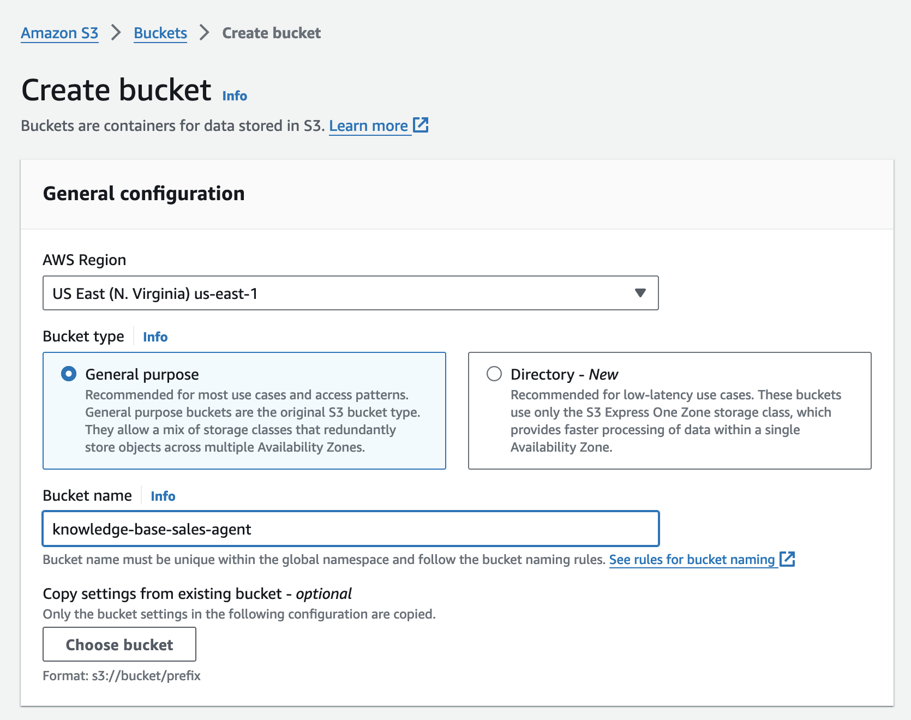
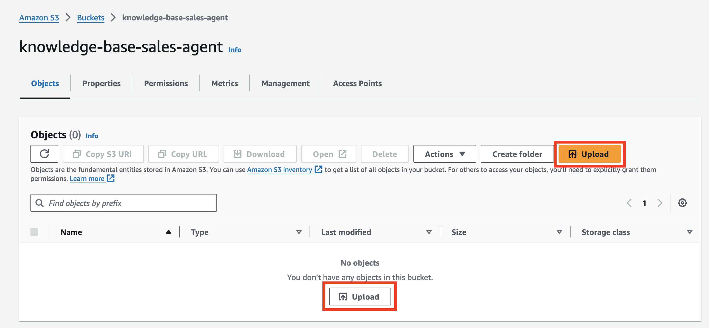
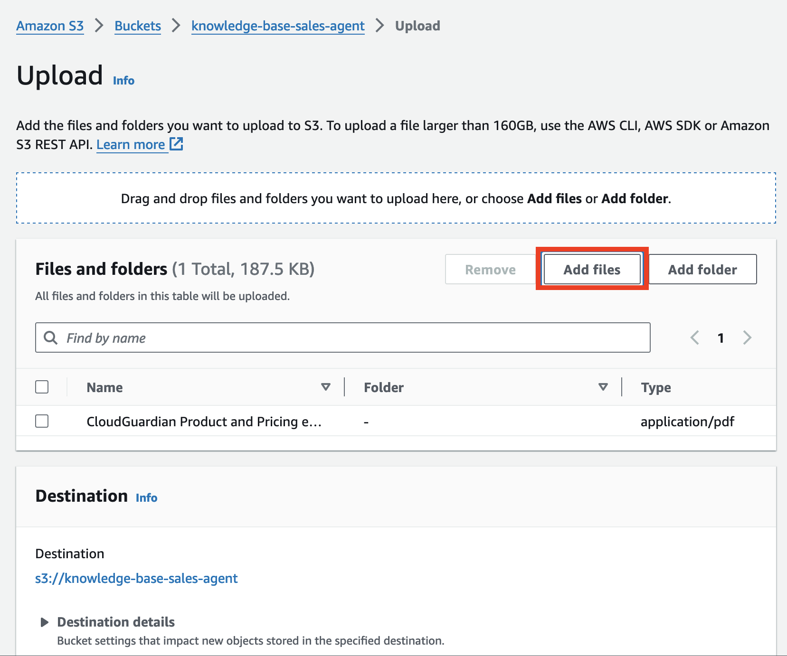
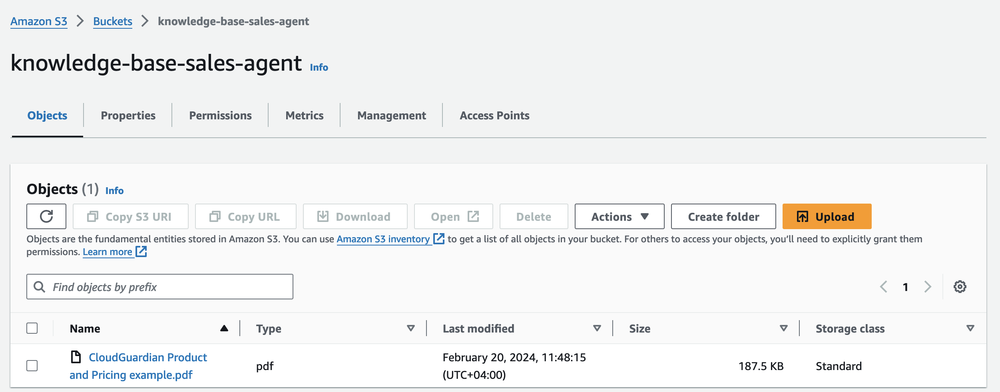
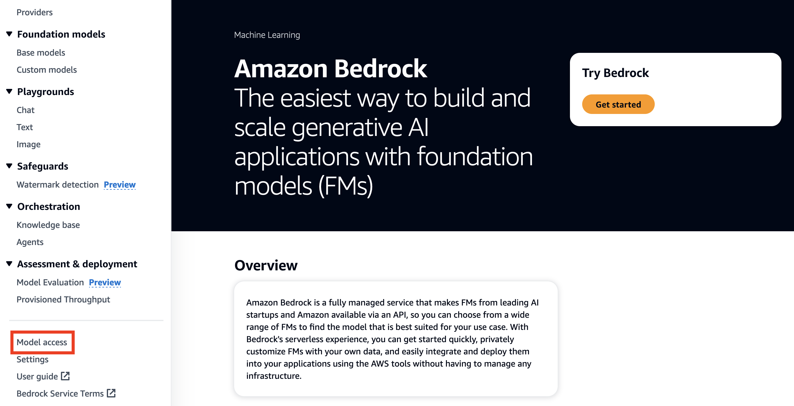
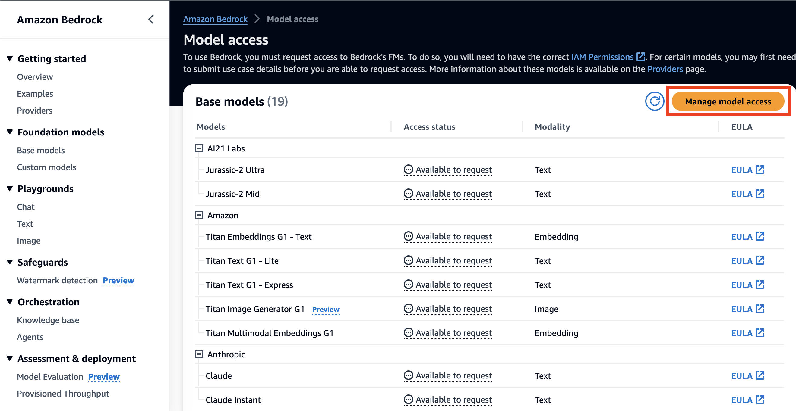
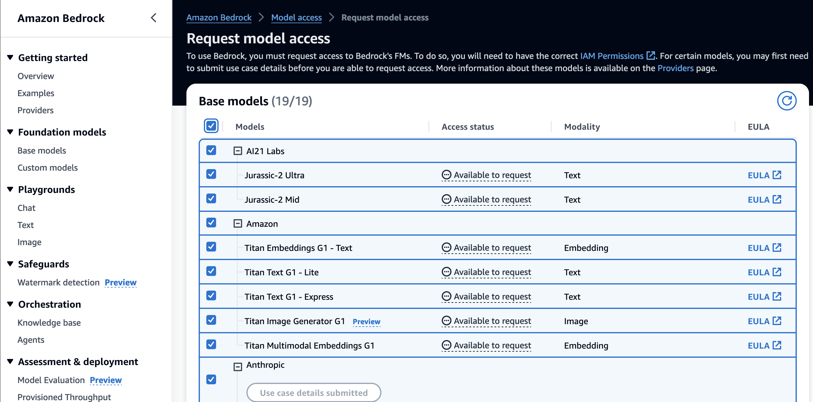
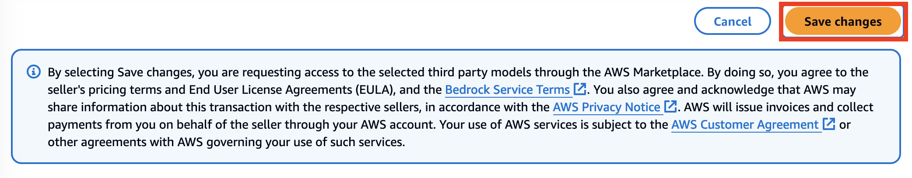

# Using Amazon Bedrock to build a simple automation system 

This repository contains a step-by-step guide and code samples build a simple automataion system powered by Generative AI to match new customers to relevant pricing plans in sales.

## What are we building

## Architecture

The architecture of the solution we are building.

1. User input their website URL on the Streamlit app
2. The app triggers the Amazon Bedrock agent
3. The agent forwards the website URL to an Amazon Bedrock Foundational Model such as Claude and determines the industry type
4. Based on the industry type, the agent queries the knowledge base and identifes the most suitable pricing plan
5. Returns pricing plan price and features to the user
6. Users interested in further details provide their email address
7. Upon receiving the email address, the agent sends an email containing the pricing plan details, including price and features, to the user.

## Initial setup

### Step 1: Creating S3 buckets
- In us-east-1 region, create an S3 bucket to store CloudGuardian's product details and features.

- Click on `Upload`

- Upload sample PDF in s3docs folder to your S3 bucket and keep default settings.

- Once successfully uploaded, you should be able to view the file in your s3 bucket

- Navigate to the Amazon Bedrock console, scroll on the left-hand side and click on `Model Access`

- Click on `Manage model access`

- Select all models

- Scroll down and `Save changes`

