# Using Amazon Bedrock to build a simple automation system 

This repository contains a step-by-step guide and code samples to build a simple automation system powered by Generative AI to match new customers to relevant pricing plans in sales.

## What are we building
This repo details the setup process for an Amazon Bedrock agent on AWS, which will include setting up a S3 bucket, a knowledge base, an action group, and a Lambda function. We will use the Streamlit framework for the user interface. The agent is built to identify the industry type from a website URL, find the best pricing plan from the knowledge base, and can also send emails if required.

## Architecture

The architecture of the solution we are building.


1. User input their website URL on the Streamlit app
2. The app triggers the Amazon Bedrock agent
3. The agent forwards the website URL to an Amazon Bedrock Foundational Model such as Claude and determines the industry type
4. Based on the industry type, the agent queries the knowledge base and identifes the most suitable pricing plan
5. Returns pricing plan price and features to the user
6. Users interested in further details provide their email address
7. Upon receiving the email address, the agent sends an email containing the pricing plan details, including price and features, to the user.

## Initial setup

### Step 1: Creating S3 buckets
- In us-east-1 region, create an S3 bucket to store CloudGuardian's product details and features. Keep default settings.


- Click on `Upload`


- Upload sample PDF in s3docs folder to your S3 bucket.


- Once successfully uploaded, you should be able to view the file in your s3 bucket


- Navigate to the Amazon Bedrock console, scroll on the left-hand side and click on `Model Access`


- Click on `Manage model access`


- Select all models


- Scroll down and `Save changes`


Perfect! You are now ready to build the solution.

## Build Solution

We will now build the backend of our solution. 

### Setup Amazon Bedrock Knowledge Base

- Navigate to [Amazon Bedrock Knowledge Bases](https://aws.amazon.com/bedrock/knowledge-bases/) section and select on `Create Knowledge Base`

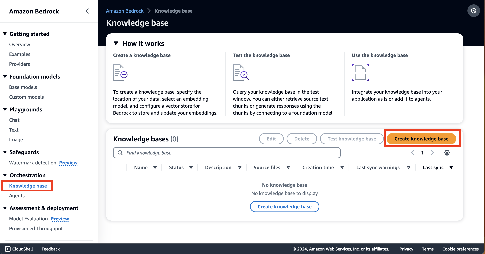

- Enter a name for your KB and description (optional). Keep the defaults, click on `Next`

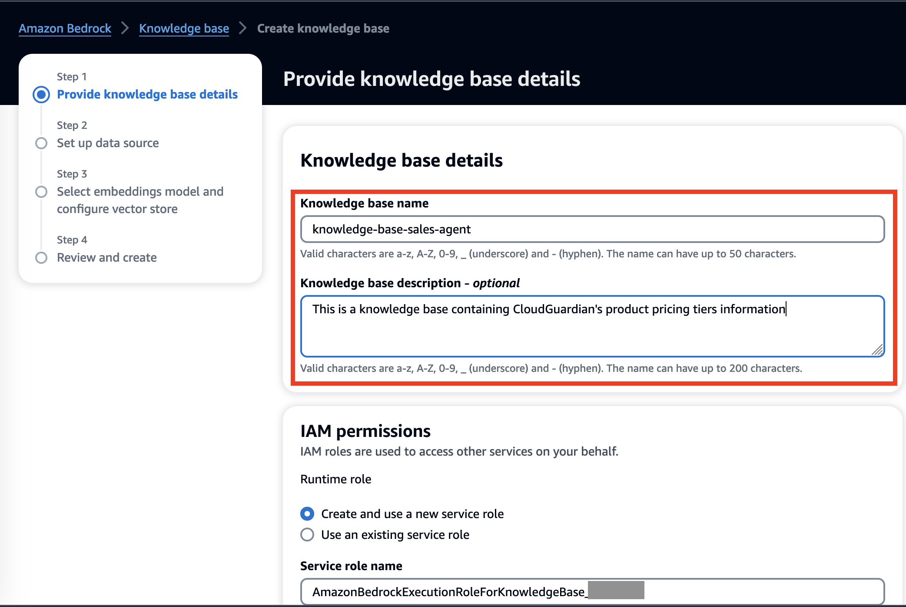

- Enter a name for your datasource and select the S3 location containing CloudGuardian's pricing plans. Click on `Next`

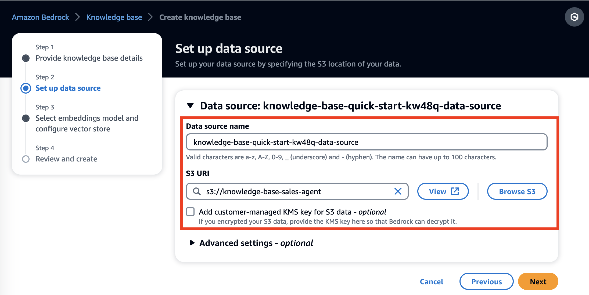

- Select the `Titan Embeddings G1 - Text` model

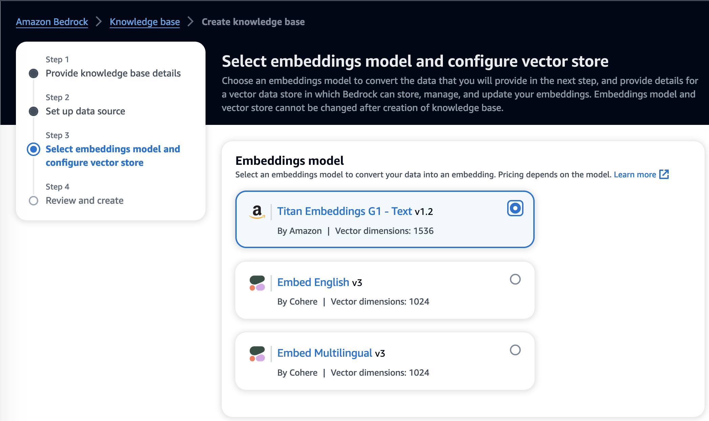

- For this demo, we shall keep the [vector database](https://docs.aws.amazon.com/bedrock/latest/userguide/knowledge-base-setup-oss.html) as Amazon OpenSearch Serverless. Click on `Next`

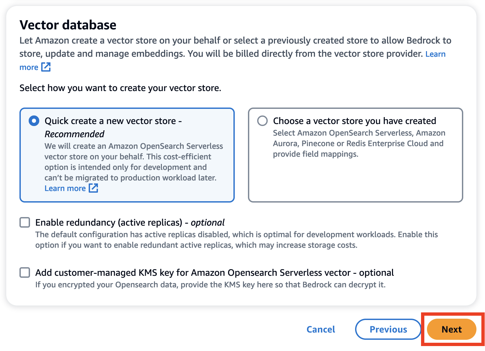

- Review your setup and click on `Create Knowledge Base`. This will take a few mins to setup

- Once your Knowledge Base setup is complete, you will come across this testing console. Click on `Select Model`

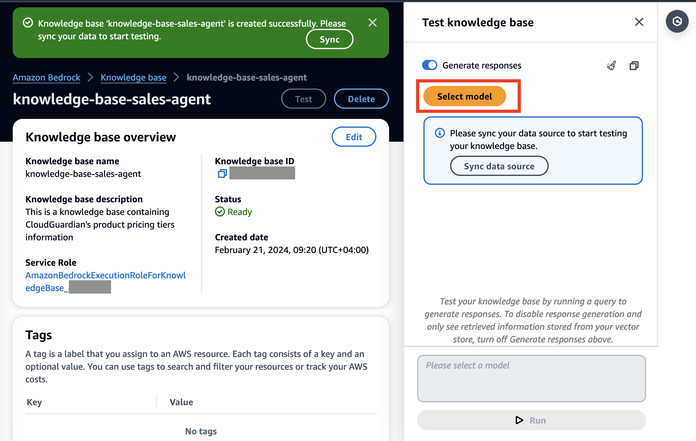

- Currently, only Anthropic models are available for Knowledge Base support. Select   `Claude 2 v2` and choose `Apply`

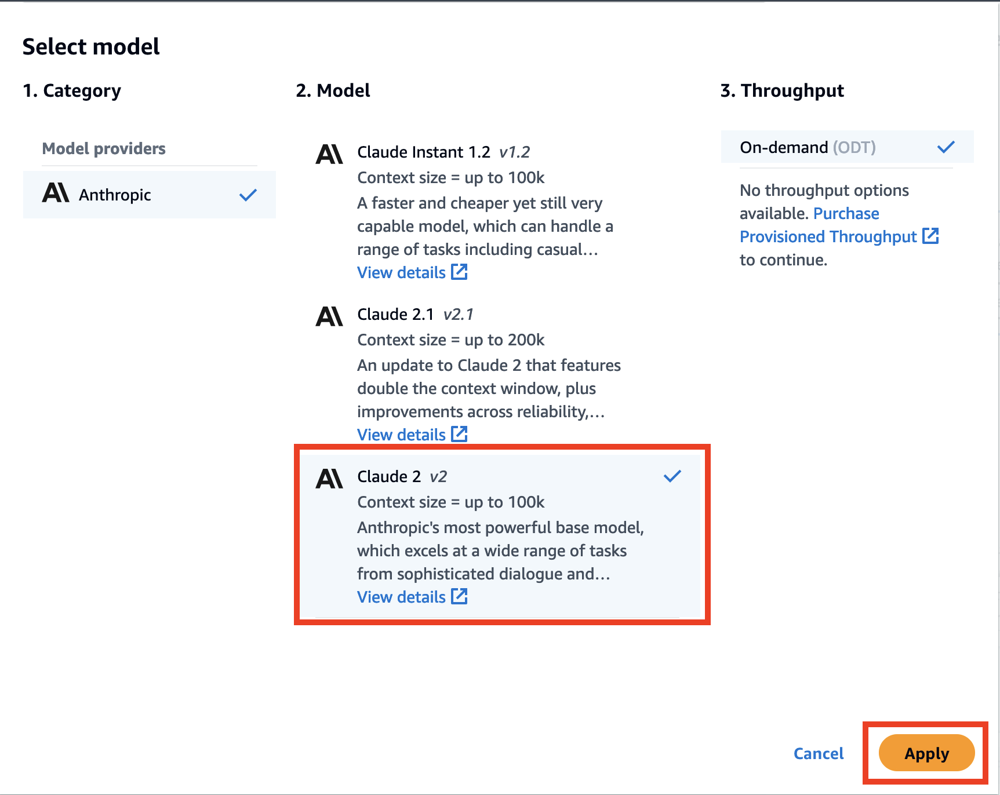

- Once applied, sync your data source

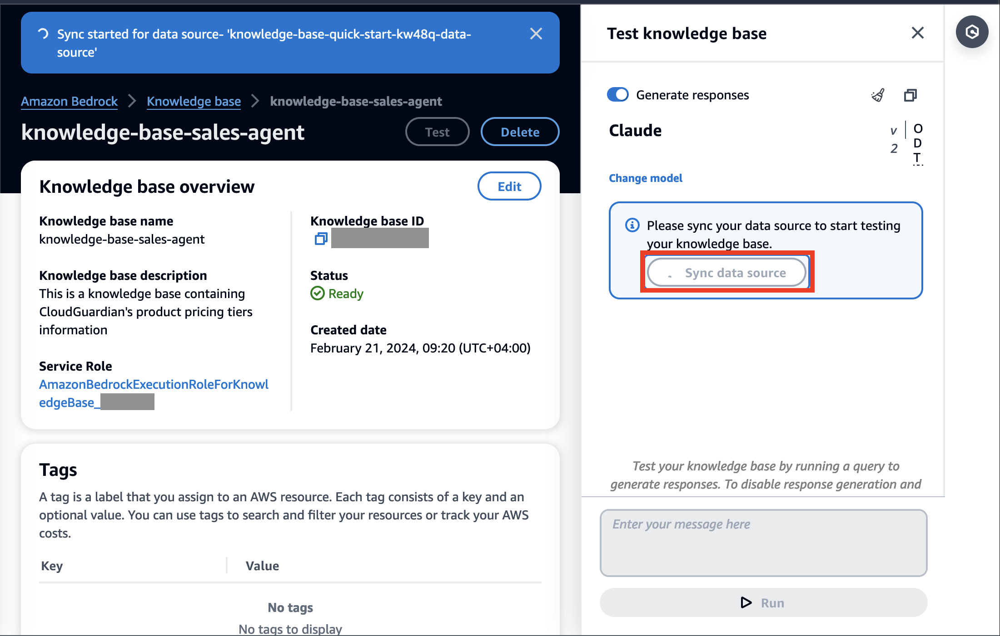

- After data source is synced successfully, you can test the Knowledge Base by running a query to generate response. This functionality can also be disabled but for this demo we keep it as it is
- Test the knowledge base with the below query:
```
I'm in the healthcare business, which pricing plan is relevant for me?
```
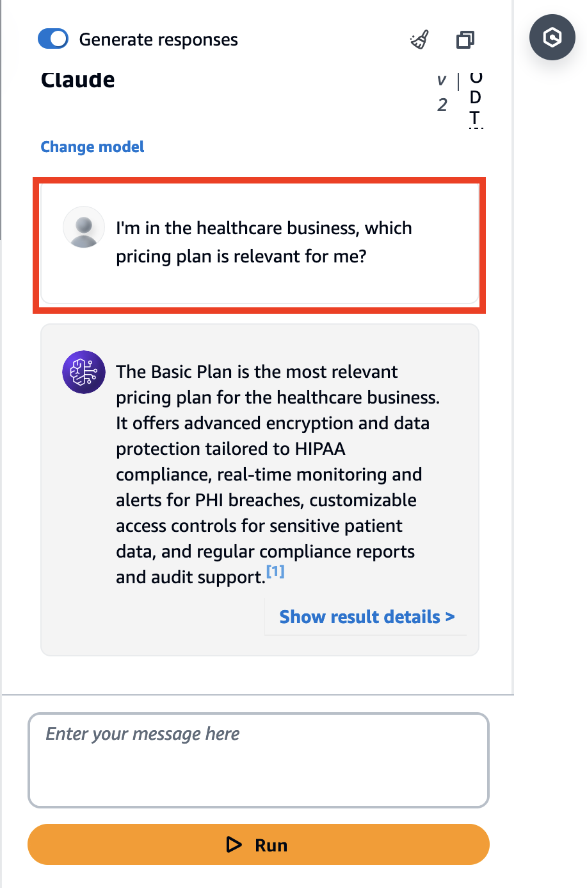

Feel free to test with other queries. 

Now that you have created your knowledge base, let's move on to building and testing our Agents. 

### Setup Amazon Bedrock Agents

- Navigate to [Amazon Bedrock Agents](https://aws.amazon.com/bedrock/agents/) and click on `Create Agent`
- Enter a suitable `Agent Name` and `Description`

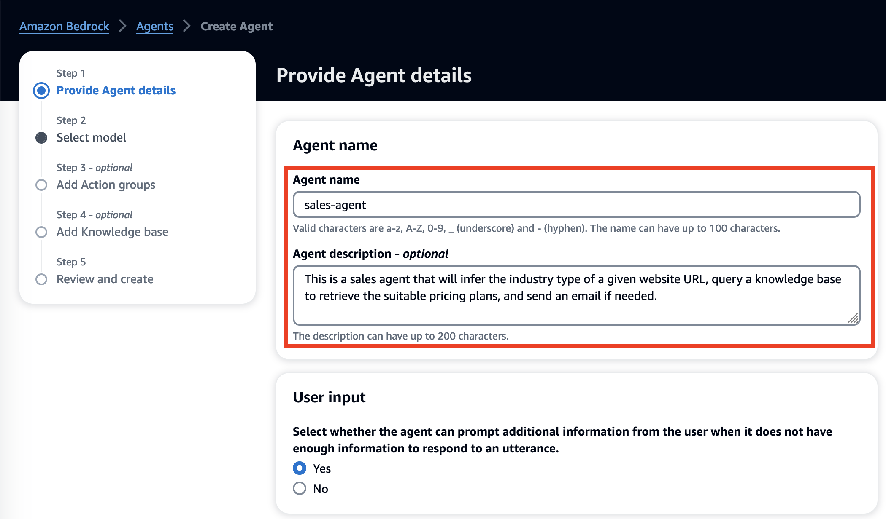

- Keep defaults and click on `Next`
- Anthropic Claude is the only available option at the moment. Provide clear and specific instructions for the agent to perform tasks
```
You are an agent that helps customers purchase pricing plans. You can 
1/ if provided, infer industry type based on a user given URL. You cannot pass the URL to the knowledge base
2/ only use knowledge base to search which pricing plan is the best fit to match industry type
3/ always return details of the pricing plan price and its features, copy them out word-for-word from the knowledge base search results
4/ then only ask for user details such as email address
5/ if indicated they want to learn more, send email with pricing plan price and features
If you're unsure say I don't know. 
```
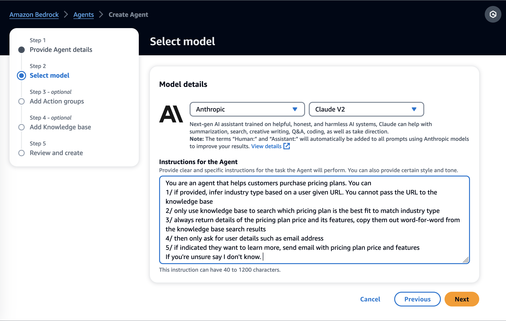

- Add Action groups. For our demo, we want the Agent to send an email on our behalf. For this to execute, we need to provide an exisiting [AWS Lambda]() function and a OpenAPI schema
- Navigate to AWS Lambda and select `Create Function`
- 